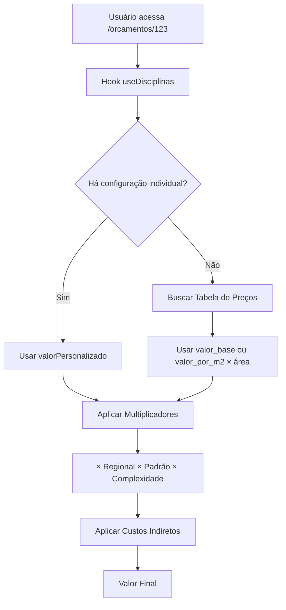

# 📊 ANÁLISE COMPLETA DA LÓGICA DE GERAÇÃO DE VALORES DO ORÇAMENTO

## 🔍 PARTE 1: MAPEAMENTO COMPLETO DAS FONTES DE DADOS

### 📍 **FONTES DE VALORES IDENTIFICADAS:**

#### 1. **DISCIPLINAS_PADRAO** (Arquivo: `types/disciplinas.ts`)
```typescript
// ❌ FONTE OBSOLETA - Valores hardcoded no código
ARQUITETURA: { valorBase: 120, horasBase: 80 }
MODELAGEM_3D: { valorBase: 45, horasBase: 30 }
ESTRUTURAL: { valorBase: 25, horasBase: 40 }
// ... outros valores fixos
```
**Status**: 🔴 **PROBLEMÁTICO** - Valores fixos no código, não configuráveis pelo usuário

#### 2. **TABELA DE PREÇOS** (API: `/api/escritorios/[id]/configuracoes`)
```typescript
// ✅ FONTE OFICIAL - Configurável pelo usuário
disciplinas: {
  ARQUITETURA: {
    ativo: boolean,
    valor_base: number,        // Ex: 15000
    valor_por_m2: number,      // Ex: 75
    valor_por_hora: number,    // Ex: 150
    horas_estimadas: number,   // Ex: 120
    multiplicador_complexidade_padrao: number // Ex: 1.0
  }
}
```
**Status**: ✅ **FONTE OFICIAL** - Configurável na aba "Tabela de Preços"

#### 3. **MULTIPLICADORES REGIONAIS** (Tabela de Preços)
```typescript
multiplicadores_regionais: {
  norte: { nome: "Norte", multiplicador: 0.85 },
  sudeste: { nome: "Sudeste", multiplicador: 1.15 },
  // ... outras regiões
}
```

#### 4. **PADRÕES DE CONSTRUÇÃO** (Tabela de Preços)
```typescript
padroes_construcao: {
  simples: { multiplicador: 0.7 },
  medio: { multiplicador: 1.0 },
  alto: { multiplicador: 1.4 },
  // ... outros padrões
}
```

#### 5. **CUSTOS INDIRETOS** (Tabela de Preços)
```typescript
custos_indiretos: {
  margem_lucro: 25.0,           // %
  overhead: 15.0,               // %
  impostos: 13.65,              // %
  reserva_contingencia: 5.0,    // %
  comissao_vendas: 3.0          // %
}
```

#### 6. **CONFIGURAÇÕES INDIVIDUAIS POR ORÇAMENTO** (API: `/api/orcamentos/[id]/disciplinas`)
```typescript
// ⚠️ FONTE SECUNDÁRIA - Sobrepõe Tabela de Preços
configuracoesPorDisciplina: {
  ARQUITETURA: {
    ativa: boolean,
    valorPersonalizado?: number,     // Sobrepõe valor_base
    multiplicadorComplexidade?: number // Sobrepõe multiplicador padrão
  }
}
```

---

## 🎯 **HIERARQUIA DE PRIORIDADE ATUAL (PROBLEMÁTICA):**

### **ORDEM DE APLICAÇÃO DOS VALORES:**

1. **🥇 PRIMEIRO**: Configurações individuais (`valorPersonalizado`)
2. **🥈 SEGUNDO**: Tabela de Preços (`valor_base` ou `valor_por_m2 × área`)
3. **🥉 TERCEIRO**: Valores padrão hardcoded (`DISCIPLINAS_PADRAO.valorBase`)

### **MULTIPLICADORES APLICADOS EM SEQUÊNCIA:**
1. **Valor Base** (da fonte prioritária acima)
2. **× Multiplicador Regional** (da Tabela de Preços)
3. **× Multiplicador Padrão Construção** (da Tabela de Preços)
4. **× Multiplicador Complexidade** (individual ou padrão)
5. **× Custos Indiretos** (margem + overhead + impostos + contingência + comissão)

---

## ⚠️ **PROBLEMAS IDENTIFICADOS:**

### 🔴 **1. DUPLICIDADE DE FONTES:**
- **Valor Base**: Existe em 3 lugares diferentes
- **Multiplicador Complexidade**: Existe em 2 lugares
- **Configurações Ativas**: Disciplinas podem estar ativas em 2 sistemas

### 🔴 **2. INCONSISTÊNCIA DE DADOS:**
- Tabela de Preços pode ter `ARQUITETURA.ativo = false`
- Mas sistema individual pode ter `ARQUITETURA.ativa = true`
- **Resultado**: Conflito sobre qual disciplina está realmente ativa

### 🔴 **3. LÓGICA CONFUSA:**
```typescript
// ❌ CÓDIGO ATUAL - Múltiplas fontes conflitantes
if (config?.valorPersonalizado) {
  valor = config.valorPersonalizado; // Fonte 1
} else if (tabelaPrecos.disciplinas[codigo]) {
  valor = tabelaPrecos.disciplinas[codigo].valor_base; // Fonte 2
} else {
  valor = disciplina.valorBase; // Fonte 3 (hardcoded)
}
```

### 🔴 **4. VALORES IGNORADOS:**
- **`valor_por_hora`**: Definido na Tabela de Preços mas nunca usado
- **`horas_estimadas`**: Definido mas não impacta cálculo final
- **`multiplicador_complexidade_padrao`**: Pode ser sobreposto por configuração individual

### 🔴 **5. FALTA DE TRANSPARÊNCIA:**
- Usuário não sabe qual fonte está sendo usada
- Alterações na Tabela de Preços podem não ter efeito se há configuração individual
- Não há indicação visual de conflitos

---

## 📋 **MAPEAMENTO DAS ABAS DE CONFIGURAÇÃO:**

### **ABA "Disciplinas e Valores"** (`/orcamentos/configuracoes` → Tabela de Preços)
- **Controla**: `disciplinas.*.valor_base`, `valor_por_m2`, `valor_por_hora`
- **Efeito**: ✅ **DEVERIA** ser a fonte oficial, mas pode ser sobreposta

### **ABA "Multiplicadores Regionais"**
- **Controla**: `multiplicadores_regionais.*`
- **Efeito**: ✅ **FUNCIONA** corretamente

### **ABA "Padrões de Construção"**
- **Controla**: `padroes_construcao.*`
- **Efeito**: ✅ **FUNCIONA** corretamente

### **ABA "Custos Indiretos"**
- **Controla**: `custos_indiretos.*`
- **Efeito**: ✅ **FUNCIONA** corretamente

### **CONFIGURAÇÃO INDIVIDUAL** (`/orcamentos/[id]` → Disciplinas)
- **Controla**: Ativação/desativação + valores personalizados
- **Efeito**: ⚠️ **SOBREPÕE** Tabela de Preços (problemático)

---

## 🎯 **FLUXO ATUAL DE CÁLCULO:**



---

## 🚨 **INCONSISTÊNCIAS CRÍTICAS ENCONTRADAS:**

### **1. Disciplina Ativa vs Inativa:**
```typescript
// Tabela de Preços
disciplinas.ARQUITETURA.ativo = false

// Configuração Individual  
configuracoesPorDisciplina.ARQUITETURA.ativa = true

// ❓ QUAL PREVALECE?
```

### **2. Valores Conflitantes:**
```typescript
// Tabela de Preços
disciplinas.ARQUITETURA.valor_base = 15000

// Configuração Individual
configuracoesPorDisciplina.ARQUITETURA.valorPersonalizado = 20000

// ❓ USUÁRIO NÃO SABE QUAL ESTÁ SENDO USADO
```

### **3. Multiplicadores Duplicados:**
```typescript
// Tabela de Preços
disciplinas.ARQUITETURA.multiplicador_complexidade_padrao = 1.2

// Configuração Individual
configuracoesPorDisciplina.ARQUITETURA.multiplicadorComplexidade = 1.5

// ❓ QUAL MULTIPLICADOR É APLICADO?
```

---

## 📊 **RESUMO DOS PROBLEMAS:**

| Problema | Impacto | Prioridade |
|----------|---------|------------|
| **Múltiplas fontes de valor** | 🔴 Alto | Crítica |
| **Conflitos de ativação** | 🔴 Alto | Crítica |
| **Valores ignorados** | 🟡 Médio | Alta |
| **Falta de transparência** | 🟡 Médio | Alta |
| **Lógica complexa** | 🟡 Médio | Média |

---

## ✅ **PRÓXIMA ETAPA: REORGANIZAÇÃO**

Na **PARTE 2**, vou:

1. **Centralizar** todas as configurações na Tabela de Preços
2. **Eliminar** duplicidades e conflitos
3. **Simplificar** a lógica de cálculo
4. **Documentar** claramente a hierarquia
5. **Implementar** transparência total para o usuário

**Status**: 📋 **ANÁLISE COMPLETA** - Pronto para reorganização