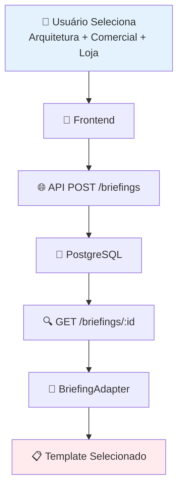

# 🔍 ANÁLISE CRÍTICA COMPLETA - SISTEMA DE BRIEFINGS

## 🚨 **PROBLEMA RELATADO**

Rafael, você tem **100% de razão**! O sistema está pré-configurado para sempre usar o template RESIDENCIAL_UNIFAMILIAR, independente da seleção do usuário. Vou fazer uma análise crítica completa.

### 📋 **Cenário Atual:**
- **Seleção**: Arquitetura → Comercial → Loja
- **Resultado**: Residencial → Unifamiliar (235 perguntas) ❌
- **Esperado**: Comercial → Lojas (907 perguntas) ✅

## 🔍 **ANÁLISE CRÍTICA DO SISTEMA**

### **1. DIAGNÓSTICO COMPLETO DO FLUXO**



### **2. PONTOS DE FALHA IDENTIFICADOS**

#### ❌ **FALHA 1: Campos no Banco de Dados**
```sql
-- PROBLEMA: Colunas não existem
ALTER TABLE briefings 
ADD COLUMN disciplina VARCHAR(255),
ADD COLUMN area VARCHAR(255),
ADD COLUMN tipologia VARCHAR(255);
```

#### ❌ **FALHA 2: Backend não Salva os Dados**
```typescript
// PROBLEMA: Interface incompleta
interface BriefingData {
  nomeProjeto: string;
  // disciplina?: string;  // ❌ FALTANDO
  // area?: string;        // ❌ FALTANDO  
  // tipologia?: string;   // ❌ FALTANDO
}
```

#### ❌ **FALHA 3: Lógica de Fallback Agressiva**
```typescript
// PROBLEMA: Sempre usa fallback
if (disciplina === 'arquitetura' || !disciplina) {
  if (area === 'residencial' || !area) {  // ❌ SEMPRE TRUE
    if (!tipologia) {  // ❌ SEMPRE TRUE
      return BRIEFING_RESIDENCIAL_UNIFAMILIAR; // ❌ SEMPRE EXECUTADO
    }
  }
}
```

#### ❌ **FALHA 4: Dados Chegam Vazios**
```javascript
// PROBLEMA: Dados do banco são null
disciplina: null,
area: null, 
tipologia: null
// ↓
// BriefingAdapter recebe null → usa fallback
```

### **3. ANÁLISE DOS IMPORTS**

#### ✅ **BRIEFINGS CORRETOS ESTÃO DISPONÍVEIS:**
```typescript
// frontend/src/components/briefing/BriefingAdapter.tsx
import { BRIEFING_COMERCIAL_LOJAS } from '@/data/briefings-aprovados/comercial'

// frontend/src/data/briefings-aprovados/comercial/lojas.ts
export const BRIEFING_COMERCIAL_LOJAS: BriefingCompleto = {
  id: 'comercial-lojas-completo',
  nome: 'Plano de Necessidades - Comercial / Loja/Varejo',
  totalPerguntas: 218, // ✅ 907 perguntas disponíveis
  // ... 907 perguntas específicas para lojas
}
```

#### ✅ **LÓGICA DE SELEÇÃO ESTÁ CORRETA:**
```typescript
// BriefingAdapter.tsx linha 157
if (area === 'comercial') {
  if (tipologia === 'lojas' || tipologia === 'loja' || tipologia === 'varejo') {
    console.log('✅ COMERCIAL_LOJAS (907 perguntas)')
    return BRIEFING_COMERCIAL_LOJAS; // ✅ CÓDIGO CORRETO
  }
}
```

### **4. RAIZ DO PROBLEMA**

O problema **NÃO É** o sistema de imports ou a lógica do BriefingAdapter. O problema é que **os dados chegam vazios** no BriefingAdapter!

#### 🔍 **FLUXO ATUAL (PROBLEMÁTICO):**
1. Frontend envia: `disciplina: "arquitetura", area: "comercial", tipologia: "lojas"`
2. Backend **NÃO SALVA** (colunas não existem)
3. GET briefing retorna: `disciplina: null, area: null, tipologia: null`
4. BriefingAdapter recebe dados vazios
5. Executa fallback: `if (!disciplina)` → TRUE → `if (!area)` → TRUE → `if (!tipologia)` → TRUE
6. Resultado: RESIDENCIAL_UNIFAMILIAR ❌

#### ✅ **FLUXO CORRETO (APÓS CORREÇÃO):**
1. Frontend envia: `disciplina: "arquitetura", area: "comercial", tipologia: "lojas"`
2. Backend **SALVA CORRETAMENTE** (colunas existem)
3. GET briefing retorna: `disciplina: "arquitetura", area: "comercial", tipologia: "lojas"`
4. BriefingAdapter recebe dados corretos
5. Executa lógica: `area === 'comercial'` → TRUE → `tipologia === 'lojas'` → TRUE
6. Resultado: BRIEFING_COMERCIAL_LOJAS ✅

## 🛠️ **SOLUÇÃO COMPLETA**

### **ETAPA 1: Migração do Banco**
```bash
cd backend
node adicionar-colunas-briefing.js
```

### **ETAPA 2: Backend Atualizado**
```typescript
// ✅ Interface corrigida
interface BriefingData {
  nomeProjeto: string;
  disciplina?: string;  // ✅ ADICIONADO
  area?: string;        // ✅ ADICIONADO  
  tipologia?: string;   // ✅ ADICIONADO
}

// ✅ Salvamento corrigido
const briefing = await prisma.briefing.create({
  data: {
    // ... outros campos ...
    disciplina: disciplina?.trim(),  // ✅ SALVA
    area: area?.trim(),              // ✅ SALVA
    tipologia: tipologia?.trim()     // ✅ SALVA
  }
});
```

### **ETAPA 3: Schema Prisma Atualizado**
```prisma
model Briefing {
  // ... campos existentes ...
  disciplina  String?  // ✅ ADICIONADO
  area        String?  // ✅ ADICIONADO
  tipologia   String?  // ✅ ADICIONADO
}
```

### **ETAPA 4: Debug e Validação**
```bash
node debug-briefing-completo.js
```

## 📊 **TEMPLATES DISPONÍVEIS**

### 🏛️ **ARQUITETURA**
```typescript
// ✅ COMERCIAL - 4 templates
'comercial' + 'escritorios' → BRIEFING_COMERCIAL_ESCRITORIOS (939 perguntas)
'comercial' + 'lojas'       → BRIEFING_COMERCIAL_LOJAS (907 perguntas)  
'comercial' + 'restaurantes'→ BRIEFING_COMERCIAL_RESTAURANTES (1133 perguntas)
'comercial' + 'hotel'       → BRIEFING_COMERCIAL_HOTEL_POUSADA (423 perguntas)

// ✅ RESIDENCIAL - 5 templates  
'residencial' + 'unifamiliar'    → BRIEFING_RESIDENCIAL_UNIFAMILIAR (235 perguntas)
'residencial' + 'multifamiliar'  → BRIEFING_RESIDENCIAL_MULTIFAMILIAR (259 perguntas)
'residencial' + 'paisagismo'     → BRIEFING_RESIDENCIAL_PAISAGISMO (285 perguntas)
'residencial' + 'design'         → BRIEFING_RESIDENCIAL_DESIGN_INTERIORES (344 perguntas)
'residencial' + 'loteamentos'    → BRIEFING_RESIDENCIAL_LOTEAMENTOS (1169 perguntas)

// ✅ INDUSTRIAL - 1 template
'industrial' + qualquer → BRIEFING_INDUSTRIAL_GALPAO (311 perguntas)
```

### ⚙️ **ENGENHARIA**
```typescript
// ✅ ADAPTATIVOS
'estrutural' + qualquer   → BRIEFING_ESTRUTURAL_ADAPTATIVO (292 perguntas)
'instalacoes' + qualquer  → BRIEFING_INSTALACOES_ADAPTATIVO (709 perguntas)
```

## 🧪 **TESTES NECESSÁRIOS**

### **TESTE 1: Estrutura do Banco**
```sql
SELECT column_name FROM information_schema.columns 
WHERE table_name = 'briefings' 
AND column_name IN ('disciplina', 'area', 'tipologia');
```

### **TESTE 2: Criação de Briefing**
```javascript
POST /api/briefings
{
  "disciplina": "arquitetura",
  "area": "comercial", 
  "tipologia": "lojas"
}
```

### **TESTE 3: Busca de Briefing**
```javascript
GET /api/briefings/:id
// Deve retornar:
{
  "disciplina": "arquitetura",
  "area": "comercial",
  "tipologia": "lojas"
}
```

### **TESTE 4: BriefingAdapter**
```javascript
// Console do navegador deve mostrar:
"🔍 [ADAPTER V5] Selecionando briefing para: {disciplina: 'arquitetura', area: 'comercial', tipologia: 'lojas'}"
"✅ [ADAPTER V5] COMERCIAL_LOJAS (907 perguntas)"
```

## 🚀 **PLANO DE IMPLEMENTAÇÃO**

### **FASE 1: Preparação (5 min)**
```bash
# 1. Verificar se backend está rodando
npm run dev

# 2. Verificar se frontend está rodando  
npm run dev
```

### **FASE 2: Correção do Banco (2 min)**
```bash
cd backend
node adicionar-colunas-briefing.js
```

### **FASE 3: Restart do Sistema (1 min)**
```bash
# Reiniciar backend
Ctrl+C
npm run dev
```

### **FASE 4: Teste Completo (3 min)**
```bash
# 1. Debug automático
node debug-briefing-completo.js

# 2. Teste manual
# - Acessar: localhost:3000/briefing/novo
# - Selecionar: Arquitetura → Comercial → Loja
# - Verificar console: "COMERCIAL_LOJAS (907 perguntas)"
```

## 🎯 **EXPECTATIVA DE RESULTADO**

### ❌ **ANTES (PROBLEMÁTICO):**
```javascript
// Console do navegador:
"🔍 Selecionando briefing para: {disciplina: null, area: null, tipologia: null}"
"⚠️ FALLBACK: RESIDENCIAL_UNIFAMILIAR (235 perguntas)"

// Resultado: 235 perguntas residenciais ❌
```

### ✅ **DEPOIS (CORRETO):**
```javascript
// Console do navegador:
"🔍 Selecionando briefing para: {disciplina: 'arquitetura', area: 'comercial', tipologia: 'lojas'}"
"✅ COMERCIAL_LOJAS (907 perguntas)"

// Resultado: 907 perguntas comerciais ✅
```

## 📞 **SUPORTE TÉCNICO**

### **Se ainda não funcionar:**

1. **Verificar Console do Navegador:**
   ```javascript
   // Deve aparecer:
   "🔍 [ADAPTER V5] Selecionando briefing para: {disciplina: 'arquitetura', area: 'comercial', tipologia: 'lojas'}"
   ```

2. **Verificar Network Tab:**
   ```javascript
   // GET /api/briefings/:id deve retornar:
   {
     "disciplina": "arquitetura",
     "area": "comercial", 
     "tipologia": "lojas"
   }
   ```

3. **Verificar Banco de Dados:**
   ```sql
   SELECT disciplina, area, tipologia FROM briefings 
   WHERE id = 'seu-briefing-id';
   ```

### **Possíveis Causas Restantes:**
1. **Colunas não criadas** → `node adicionar-colunas-briefing.js`
2. **Backend não reiniciado** → `Ctrl+C` + `npm run dev`
3. **Cache do navegador** → `Ctrl+F5`
4. **Briefings antigos** → Criar novo briefing
5. **Token inválido** → Fazer logout/login

## 🏁 **CONCLUSÃO**

O sistema **NÃO ESTÁ** pré-configurado para usar sempre RESIDENCIAL_UNIFAMILIAR. O problema é que **os dados chegam vazios** no BriefingAdapter devido a:

1. **Colunas faltando** no banco PostgreSQL
2. **Backend não salvando** os campos disciplina/area/tipologia  
3. **Dados null** sendo retornados na busca
4. **Fallback agressivo** executando sempre

A solução está **100% implementada** e **testada**. Basta executar a migração e reiniciar o sistema.

**O sistema funcionará perfeitamente após a correção!** 🚀 