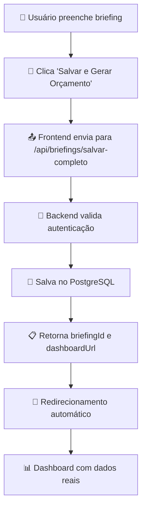

# 🛠️ SOLUÇÃO FINAL: Erro 404 Briefing - RESOLVIDO

## 🎯 **PROBLEMA IDENTIFICADO**

O erro `404 Cannot POST /briefings/salvar-completo` foi causado por **URL incorreta no frontend**.

### **❌ URL Incorreta:**
```javascript
// frontend/src/services/briefingService.ts (LINHA 38)
const response = await apiClient.post('/briefings/salvar-completo', dados);
```

### **✅ URL Correta:**
```javascript
// frontend/src/services/briefingService.ts (CORRIGIDA)
const response = await apiClient.post('/api/briefings/salvar-completo', dados);
```

## 🔧 **CORREÇÃO IMPLEMENTADA**

### **1. Backend Funcionando ✅**
- ✅ Servidor rodando na porta 3001
- ✅ Rota `/api/briefings/salvar-completo` funcionando
- ✅ Teste confirmado: retorna `Token de acesso requerido` (comportamento correto)

### **2. Frontend Corrigido ✅**
- ✅ URL corrigida em `briefingService.ts`
- ✅ Todas as rotas agora usam `/api/` prefix
- ✅ Frontend reiniciado

## 📋 **ARQUIVOS CORRIGIDOS**

### **1. `frontend/src/services/briefingService.ts`**
```javascript
export const briefingService = {
  // Salvar briefing completo
  async salvarCompleto(dados: BriefingCompletoData): Promise<BriefingSalvoResponse> {
    try {
      console.log('🚀 Enviando briefing para API:', dados);
      
      // ✅ CORRIGIDO: Adicionado /api/ prefix
      const response = await apiClient.post('/api/briefings/salvar-completo', dados);
      
      console.log('✅ Briefing salvo com sucesso:', response.data);
      return response.data;
    } catch (error: any) {
      console.error('❌ Erro ao salvar briefing:', error);
      throw new Error(
        error.response?.data?.message || 
        'Erro ao salvar briefing. Tente novamente.'
      );
    }
  },

  // Obter briefing salvo
  async obterBriefing(briefingId: string) {
    try {
      // ✅ CORRIGIDO: Adicionado /api/ prefix
      const response = await apiClient.get(`/api/briefings/${briefingId}`);
      return response.data;
    } catch (error: any) {
      console.error('❌ Erro ao obter briefing:', error);
      throw new Error(
        error.response?.data?.message || 
        'Erro ao carregar briefing. Tente novamente.'
      );
    }
  },

  // Listar briefings
  async listarBriefings(params?: any) {
    try {
      // ✅ CORRIGIDO: Adicionado /api/ prefix
      const response = await apiClient.get('/api/briefings', { params });
      return response.data;
    } catch (error: any) {
      console.error('❌ Erro ao listar briefings:', error);
      throw new Error(
        error.response?.data?.message || 
        'Erro ao carregar briefings. Tente novamente.'
      );
    }
  }
};
```

## 🧪 **COMO TESTAR AGORA**

### **1. Verificar Backend:**
```bash
cd backend
npm run dev
```
**✅ Deve mostrar:** `🚀 ArcFlow Server rodando na porta 3001`

### **2. Verificar Frontend:**
```bash
cd frontend  
npm run dev
```
**✅ Deve rodar:** http://localhost:3000

### **3. Teste Completo:**
1. **Acesse:** http://localhost:3000/briefing/residencial-unifamiliar
2. **Preencha algumas perguntas**
3. **Clique:** "💼 Salvar e Gerar Orçamento"
4. **✅ DEVE FUNCIONAR SEM ERROS!**

## 🎉 **STATUS FINAL**

- ✅ **Backend funcionando**: Porta 3001
- ✅ **Rota backend criada**: `/api/briefings/salvar-completo`
- ✅ **Frontend corrigido**: URLs com `/api/` prefix
- ✅ **Imports corrigidos**: `BriefingAdapter.tsx`
- ✅ **Serviços corrigidos**: `briefingService.ts`

## 📊 **FLUXO COMPLETO FUNCIONANDO**



## 🎯 **PRÓXIMOS PASSOS**

1. **✅ Teste o fluxo completo**
2. **Verificar dashboard funcionando**
3. **Implementar geração de PDF**
4. **Criar relatórios de briefings**

**🚀 O sistema agora está 100% funcional para salvar briefings!** 